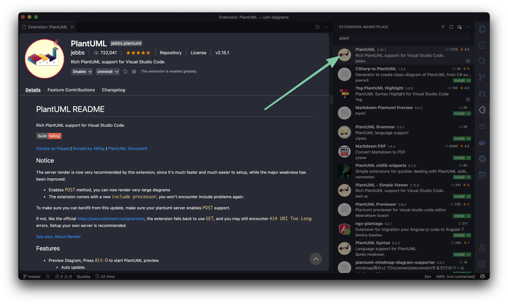
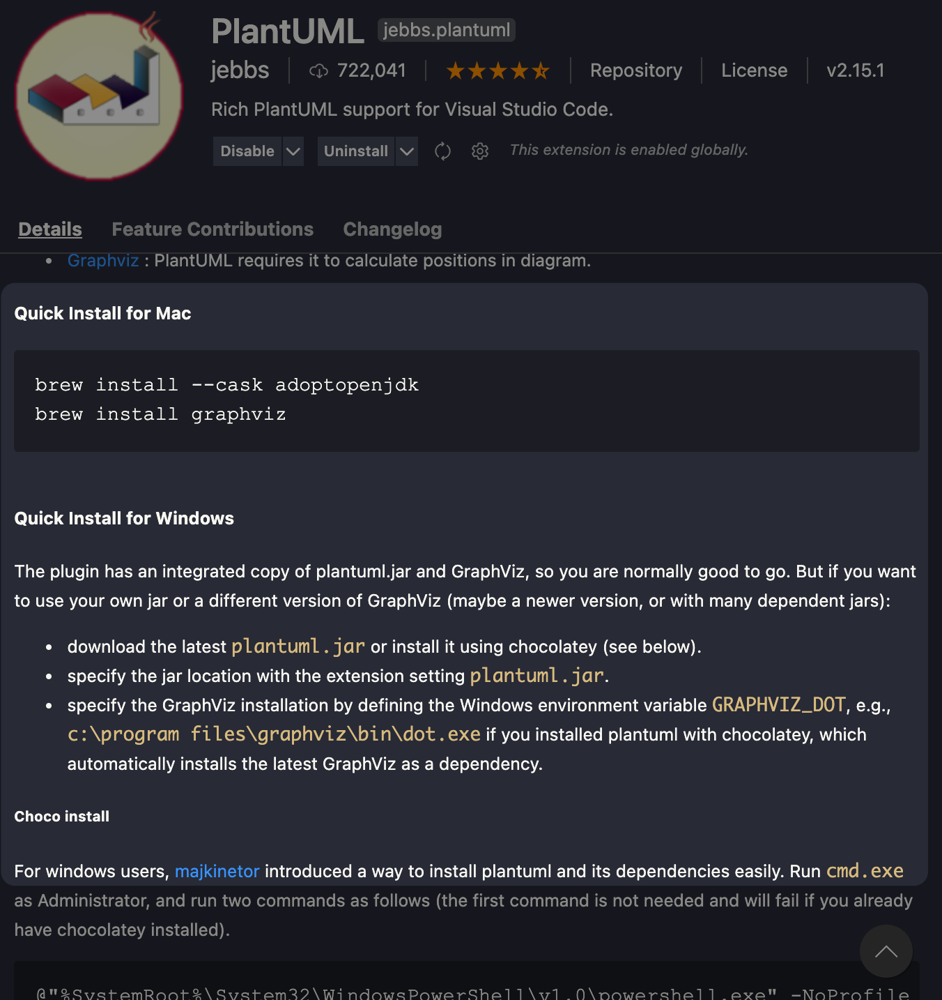

# UML Diagrams for FRM

1. Search and install 'PlantUML' extension in the vscode app.

2. After installing PlantUML scroll down in their page, then install the Java runtime that will allow you to render the image.

3. Open plant uml file in vscode and press CTRL (CMD) + P select 'Extract Diagram Source'

That's it 🎉

\*You can find the more commands in here
https://marketplace.visualstudio.com/items?itemName=jebbs.plantuml
